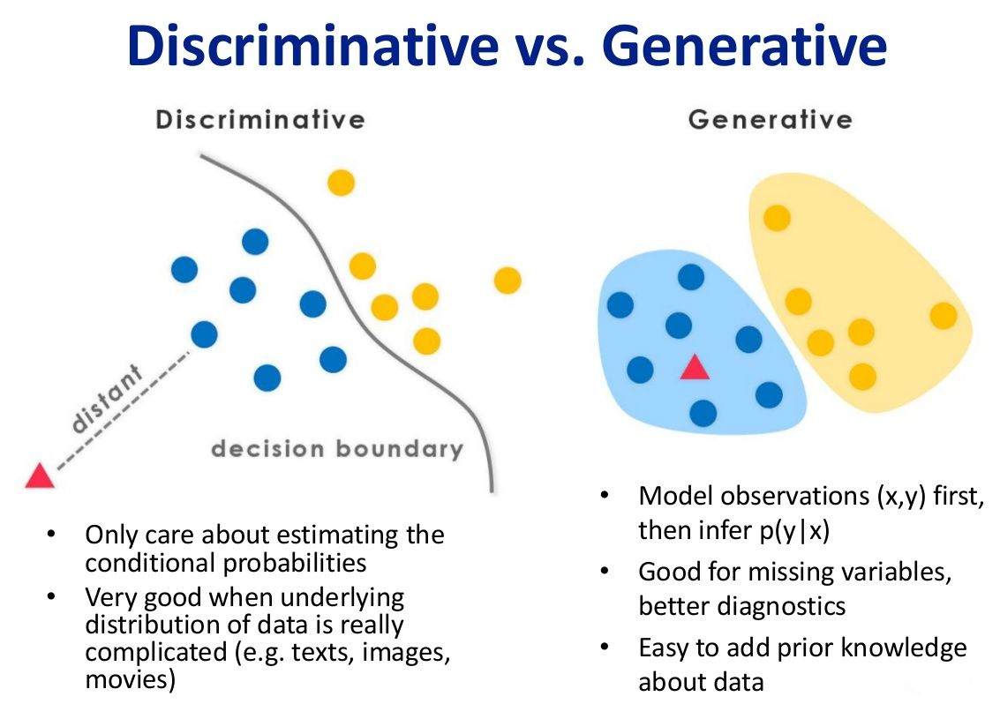

# Introduction
Informally:

- **Generative models** can generate new data instances.
- **Discriminative models** discriminate between different kinds of data instances.

A generative model could generate new photos of animals that look like real animals, while a discriminative model could tell a dog from a cat. 

More formally, given a set of data instances X and a set of labels Y:

- **Generative models** capture the joint probability $p(X, Y)$, or just $p(X)$ if there are no labels.
- **Discriminative models** capture the conditional probability $p(Y | X)$.

A *generative model* includes the distribution of the data itself, and tells you how likely a given example is. For example, models that predict the next word in a sequence are typically generative models (usually much simpler than GANs) because they can assign a probability to a sequence of words.

A *discriminative model* ignores the question of whether a given instance is likely, and just tells you how likely a label is to apply to the instance.

**Discriminative models** try to ==draw boundaries== in the data space, while **generative models** try to model ==how data is placed throughout the space==. For example, the following diagram shows discriminative and generative models of handwritten digits:

> 判别式模型举例：要确定一个羊是山羊还是绵羊，用判别模型的方法是从历史数据中学习到模型，然后通过提取这只羊的特征来预测出这只羊是山羊的概率，是绵羊的概率。
> 
>  $$\sum P(X,Y)=1$$
> 生成式模型举例：利用生成模型是根据山羊的特征首先学习出一个山羊的模型，然后根据绵羊的**特征学习**出一个绵羊的模型，然后从这只羊中提取特征，放到山羊模型中看概率是多少，在放到绵羊模型中看概率是多少，哪个大就是哪个
> 
>  $$\sum P(Y|X)=1 \ \ Y={y_1,..y_n}$$

----------------------

**Probabilistic graphical models (PGMs)** are a rich framework for encoding probability distributions over complex domains like joint distributions over large numbers of random variables that interact with each other.

# Model Structures
We have a joint model over labels $Y=y$, and features $X={x_1, x_2, …x_n}$. The joint distribution of the model can be represented as $$p(Y , X) = P(y, x_1,x_2…x_n)$$
Our goal is to estimate the probability of spam email: $$P(Y=1|X)$$
To get the conditional probability $P(Y|X)$, ==generative models== estimate the *prior* $P(Y)$ and *likelihood* $P(X|Y)$ from training data and use Bayes rule to calculate the *posterior* $P(Y |X)$:$$ P(Y|X) = \frac{P(Y) \times P(X|Y)}{P(X)}$$

==discriminative models== directly assume functional form for $P(Y|X)$ and estimate parameters of $P(Y|X)$ directly from training data.
The graph above shows the difference in the structures of generative and discriminative models. The circles represent variable(s) and the direction of the lines indicates what probabilities we can infer. In our spam classification problem, we are given $X$: the words in the emails, and $Y$ is unknown. We see that the arrow in the discriminative model graph(right) is pointing from $X$ to $Y$, indicating that we can infer $P(Y|X)$ directly from the given $X$. However, the arrow in the generative model graph(left) is pointing towards the opposite direction, which means we need to infer the values of $P(Y)$ and $P(X|Y)$ from the data first and use them to calculate $P(Y|X)$.

# Mathematical Deductions

The graph above shows the underlying probability distributions of these two models when features $X$ are expanded. We can see that each feature xi depends on all the previous features: ${x1, x2…x(i-1)}$. This won’t affect discriminative models as they simply treat $X$ as given facts and all they need to estimate is $P(Y|X)$, but it makes computing hard in generative models.
#### Generative Models (Naive Bayes)
$$P(Y|X)=\frac{P(y)*P(x_1|y)P(x_2|y,x_1)...P(x_i|y,x_1,...,x_{i-1})}{P(X)}$$
$$ \begin{aligned}
x_1 \ \perp \ x_2 ...x_i
\end{aligned}$$
With this assumption, now we can rewrite the posterior distribution as:
$$P(Y|X)=\frac{P(y)*P(x_1|y)P(x_2|y)...P(x_i|y)}{P(X)}$$

#### Discriminative Models (Logistic Regression)
As we mentioned earlier, we can directly estimate the posterior probability for discriminative models with training data:
$$P(Y|X)=P(y|x_1...x_i)$$
In **Logistic Regression**, we parameterize the posterior probability as:

**Maximum likelihood** estimation is used to estimate the parameters.

# Reference
- [Background: What is a Generative Model?](https://developers.google.com/machine-learning/gan/generative)
- [Generative vs. Discriminative Probabilistic Graphical Models](https://towardsdatascience.com/generative-vs-2528de43a836)
- [Google AI](https://ai.google/education/)